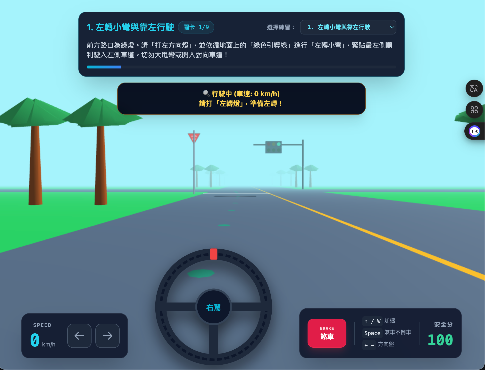

# 沖繩右駕模擬器

3D 第一人稱視角沖繩右駕模擬練習，幫助前往日本自駕的旅客熟悉靠左行駛、右駕轉彎與當地複雜號誌。

## 立即體驗

👉 [https://sobadrush.github.io/okinawa-right-hand-drive-simulator/](https://sobadrush.github.io/okinawa-right-hand-drive-simulator/)

## 關卡列表

| 關卡 | 練習重點 |
|------|---------|
| 1. 左轉小彎與靠左行駛 | 左轉貼內側，靠左車道行駛 |
| 2. 右轉大彎與禮讓對向 | 右轉繞大圈，禮讓直行車 |
| 3. 一時停止標誌與白線 | 白線前完全煞停 2 秒確認 |
| 4. 紅燈 + 左轉綠箭頭 ← | 紅燈時左轉箭頭亮起可通行 |
| 5. 閃爍黃燈 | 注意慢行，無須強制停車 |
| 6. 閃爍紅燈 | 等同一時停止，必須完全煞停 |
| 7. 紅燈 + 右轉綠箭頭 → | 箭頭亮起可右轉，對向為紅燈 |
| 8. 紅燈 + 直行綠箭頭 ↑ | 僅可直行，禁止轉彎 |
| 9. 綜合號誌大考驗 | 複合箭頭判斷與合規轉彎 |

## 操作方式

| 按鍵 | 功能 |
|------|------|
| ↑ / W | 加速 |
| Space / 煞車按鈕 | 煞車（不倒車） |
| ← → / A D | 方向盤 |
| 左/右方向燈按鈕 | 切換方向燈 |

## 技術說明

純靜態 HTML，使用 Three.js（WebGL）渲染 3D 場景，無需後端伺服器，直接部署於 GitHub Pages。

## 授權

僅供教育練習使用。
